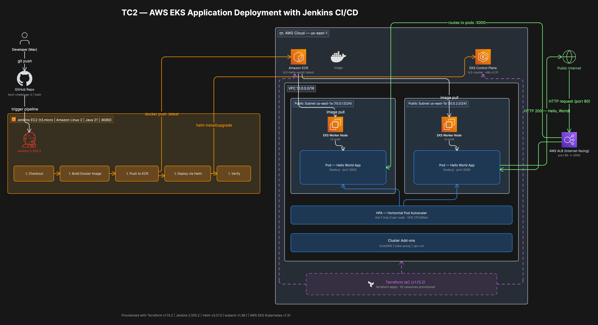

# Tech Challenge 2 — AWS EKS Application Deployment with Jenkins CI/CD

## Overview

This project deploys a containerized Node.js web application to **AWS Elastic Kubernetes Service (EKS)** using a fully automated CI/CD pipeline powered by **Jenkins** and infrastructure provisioned entirely with **Terraform**.

The pipeline automatically builds a Docker image, pushes it to Amazon ECR, and deploys it to a Kubernetes cluster using Helm — all triggered by a code push to GitHub.

**Live Application URL:**
http://a8262c3cbe3aa47a0b702a902028bfd7-1036129372.us-east-1.elb.amazonaws.com

---

## Architecture Diagram



### Architecture Summary
Developer → GitHub → Jenkins Pipeline → ECR → EKS Cluster → ALB → Internet

| Layer | Technology | Details |
|---|---|---|
| Source Control | GitHub | Private repo, main branch |
| CI/CD | Jenkins 2.555.2 | EC2 t3.micro, port 8080 |
| Container Registry | Amazon ECR | tc2-hello-world |
| Orchestration | AWS EKS | Kubernetes v1.31 |
| Infrastructure | Terraform v1.15.2 | 52 resources |
| Packaging | Helm v3.21.0 | tc2-app chart |
| Load Balancing | AWS ALB | Internet-facing, port 80 |
| Autoscaling | HPA | 1–3 pods at 50% CPU/Memory |

---

## Prerequisites

### Local Machine
- AWS CLI v2 configured with valid credentials
- Terraform v1.0+
- kubectl v1.36+
- Helm v3.21+
- Docker v25+
- Git

### AWS Account Requirements
- IAM user with AdministratorAccess (or equivalent permissions for EKS, ECR, VPC, IAM)
- Default VPC available in us-east-1 (create with `aws ec2 create-default-vpc` if missing)

### Tools Installation (Mac)
```bash
brew install terraform kubectl helm awscli
```

---

## Project Structure
tech-challenge-2/
├── app/
│   ├── app.js              # Node.js Hello World server
│   ├── package.json        # Node.js dependencies
│   └── Dockerfile          # Container build instructions
├── terraform/
│   ├── main.tf             # Terraform provider configuration
│   ├── variables.tf        # Input variables
│   ├── vpc.tf              # VPC and networking
│   ├── eks.tf              # EKS cluster and node group
│   ├── ecr.tf              # ECR repository
│   └── outputs.tf          # Infrastructure outputs
├── helm/
│   └── tc2-app/
│       ├── Chart.yaml      # Helm chart metadata
│       ├── values.yaml     # Deployment configuration
│       └── templates/
│           ├── deployment.yaml   # Kubernetes Deployment
│           └── service.yaml      # Kubernetes LoadBalancer Service
├── jenkins/
│   └── Jenkinsfile         # CI/CD pipeline definition
├── architecture.png        # Architecture diagram
└── README.md

---

## Web Application

A minimal Node.js HTTP server built with zero external dependencies.

**app/app.js**
```javascript
const http = require('http');
const PORT = process.env.PORT || 3000;

const server = http.createServer((req, res) => {
  res.writeHead(200, { 'Content-Type': 'text/plain' });
  res.end('Hello, World!\n');
});

server.listen(PORT, () => {
  console.log(`Server running on port ${PORT}`);
});
```

**Verify locally:**
```bash
cd app
node app.js &
curl http://localhost:3000
# Output: Hello, World!
kill %1
```

---

## Docker

The application is containerized using a lightweight Alpine-based Node.js image.

**app/Dockerfile**
```dockerfile
FROM node:18-alpine
WORKDIR /app
COPY package.json .
RUN npm install --production
COPY . .
EXPOSE 3000
CMD ["node", "app.js"]
```

**Why node:18-alpine?**
Alpine Linux is a minimal 5MB base image vs 900MB for full Ubuntu. Smaller images mean faster pulls, less attack surface, and reduced ECR storage costs.

**Build and test locally:**
```bash
cd app
docker build -t tc2-hello-world .
docker run -p 3000:3000 tc2-hello-world
curl http://localhost:3000
# Output: Hello, World!
```

---

## Infrastructure Setup (Terraform)

All AWS infrastructure is provisioned using Terraform. No manual AWS console configuration is required.

### Infrastructure Provisioned

| Resource | Details |
|---|---|
| VPC | 10.0.0.0/16, DNS enabled |
| Public Subnet A | us-east-1a — 10.0.1.0/24 |
| Public Subnet B | us-east-1b — 10.0.2.0/24 |
| Internet Gateway | Attached to VPC |
| EKS Cluster | tc2-cluster, Kubernetes v1.31 |
| EKS Node Group | 2 × t3.small, auto-scales 1–4 nodes |
| ECR Repository | tc2-hello-world |
| IAM Roles | EKS cluster role, node group role |
| Security Groups | Cluster and node communication rules |
| Cluster Add-ons | CoreDNS, kube-proxy, vpc-cni |

### Deploy Infrastructure

```bash
cd terraform

# Initialize Terraform (downloads providers and modules)
terraform init

# Preview resources to be created
terraform plan

# Apply infrastructure (~15-20 minutes for EKS)
terraform apply -auto-approve
```

### Expected Outputs
cluster_endpoint     = "https://XXXX.gr7.us-east-1.eks.amazonaws.com"
cluster_name         = "tc2-cluster"
cluster_region       = "us-east-1"
configure_kubectl    = "aws eks update-kubeconfig --region us-east-1 --name tc2-cluster"
ecr_repository_url   = "798329741292.dkr.ecr.us-east-1.amazonaws.com/tc2-hello-world"

### Connect kubectl to Cluster

```bash
aws eks update-kubeconfig --region us-east-1 --name tc2-cluster
kubectl get nodes
```

Expected:
NAME                          STATUS   ROLES    AGE   VERSION
ip-10-0-1-142.ec2.internal    Ready    <none>   5m    v1.31.14-eks-7fcd7ec
ip-10-0-2-74.ec2.internal     Ready    <none>   5m    v1.31.14-eks-7fcd7ec

### Tear Down Infrastructure

```bash
terraform destroy -auto-approve
```

---

## Kubernetes Deployment (Helm)

The application is packaged and deployed to EKS using a Helm chart.

### Helm Chart Configuration (values.yaml)

```yaml
replicaCount: 1

image:
  repository: 798329741292.dkr.ecr.us-east-1.amazonaws.com/tc2-hello-world
  pullPolicy: Always
  tag: "latest"

service:
  type: LoadBalancer
  port: 80
  targetPort: 3000

autoscaling:
  enabled: true
  minReplicas: 1
  maxReplicas: 3
  targetCPUUtilizationPercentage: 50
  targetMemoryUtilizationPercentage: 50
```

### Manual Deployment

```bash
# Authenticate Docker to ECR
aws ecr get-login-password --region us-east-1 | \
  docker login --username AWS --password-stdin \
  798329741292.dkr.ecr.us-east-1.amazonaws.com

# Build and push image
docker build -t tc2-hello-world ./app
docker tag tc2-hello-world:latest \
  798329741292.dkr.ecr.us-east-1.amazonaws.com/tc2-hello-world:latest
docker push \
  798329741292.dkr.ecr.us-east-1.amazonaws.com/tc2-hello-world:latest

# Deploy with Helm
helm install tc2-app ./helm/tc2-app

# Upgrade existing deployment
helm upgrade tc2-app ./helm/tc2-app
```

### Apply Horizontal Pod Autoscaler

```bash
kubectl autoscale deployment tc2-app \
  --cpu-percent=50 \
  --min=1 \
  --max=3
```

### Verify Deployment

```bash
# Check pods are running
kubectl get pods

# Check service and get public URL
kubectl get service tc2-app-service

# Test the live application
curl http://$(kubectl get service tc2-app-service \
  -o jsonpath='{.status.loadBalancer.ingress[0].hostname}')
# Output: Hello, World!
```

---

## Jenkins CI/CD Pipeline

### Jenkins Server

| Property | Value |
|---|---|
| Instance Type | EC2 t3.micro |
| OS | Amazon Linux 2 |
| Java | Amazon Corretto 21 |
| Jenkins Version | 2.555.2 |
| Port | 8080 |

> **Note:** The Jenkins EC2 instance and its supporting infrastructure (security groups, IAM role) are provisioned manually, not by Terraform.

### Jenkins Setup

**Required plugins (installed via suggested plugins):**
- Git Plugin
- Pipeline Plugin
- Credentials Plugin

**Required tools installed on Jenkins EC2:**
- Docker 25.0.14
- AWS CLI 2.34.48
- kubectl v1.36.1
- Helm v3.21.0

### Jenkinsfile Pipeline Stages
Stage 1: Checkout         → Pulls latest code from GitHub main branch
Stage 2: Build Docker     → Builds Docker image from app/Dockerfile
Stage 3: Push to ECR      → Authenticates to ECR and pushes :latest image
Stage 4: Deploy to EKS    → Runs helm upgrade/install to Kubernetes cluster
Stage 5: Verify           → Confirms pods are Running and service is active

**jenkins/Jenkinsfile:**
```groovy
pipeline {
    agent any

    environment {
        AWS_REGION      = 'us-east-1'
        ECR_REGISTRY    = '798329741292.dkr.ecr.us-east-1.amazonaws.com'
        ECR_REPO        = 'tc2-hello-world'
        IMAGE_TAG       = "latest"
        CLUSTER_NAME    = 'tc2-cluster'
        HELM_RELEASE    = 'tc2-app'
        HELM_CHART_PATH = './helm/tc2-app'
    }

    stages {
        stage('Checkout') {
            steps {
                checkout scm
                echo 'Code checked out from GitHub'
            }
        }
        stage('Build Docker Image') {
            steps {
                sh 'docker build -t $ECR_REPO:$IMAGE_TAG ./app'
            }
        }
        stage('Push to ECR') {
            steps {
                sh '''
                    aws ecr get-login-password --region $AWS_REGION | \
                    docker login --username AWS --password-stdin $ECR_REGISTRY
                    docker tag $ECR_REPO:$IMAGE_TAG $ECR_REGISTRY/$ECR_REPO:$IMAGE_TAG
                    docker push $ECR_REGISTRY/$ECR_REPO:$IMAGE_TAG
                '''
            }
        }
        stage('Deploy to EKS') {
            steps {
                sh '''
                    aws eks update-kubeconfig --region $AWS_REGION --name $CLUSTER_NAME
                    sed -i "s|v1alpha1|v1beta1|g" ~/.kube/config
                    helm upgrade $HELM_RELEASE $HELM_CHART_PATH || \
                    helm install $HELM_RELEASE $HELM_CHART_PATH
                '''
            }
        }
        stage('Verify Deployment') {
            steps {
                sh '''
                    kubectl rollout status deployment/$HELM_RELEASE --timeout=120s
                    kubectl get pods
                    kubectl get service ${HELM_RELEASE}-service
                '''
            }
        }
    }

    post {
        success { echo 'Pipeline completed — app deployed to EKS' }
        failure { echo 'Pipeline failed — check logs above' }
    }
}
```

### Configure Jenkins Pipeline Job

1. Open Jenkins at `http://<JENKINS_EC2_IP>:8080`
2. Click **New Item** → name it `tc2-pipeline` → select **Pipeline** → click OK
3. Under **Pipeline** section:
   - Definition: `Pipeline script from SCM`
   - SCM: `Git`
   - Repository URL: `https://github.com/noeldarrendavid-source/tech-challenge-2.git`
   - Credentials: Add GitHub Personal Access Token
   - Branch: `*/main`
   - Script Path: `jenkins/Jenkinsfile`
4. Click **Save**
5. Click **Build Now**

---

## Verification

### Check All Components Are Healthy

```bash
# EKS nodes
kubectl get nodes
# Expected: 2 nodes in Ready state

# Running pods
kubectl get pods
# Expected: tc2-app-XXXXX   1/1   Running

# LoadBalancer service
kubectl get service tc2-app-service
# Expected: EXTERNAL-IP shows ALB hostname

# HPA status
kubectl get hpa
# Expected: tc2-app   Deployment/tc2-app   cpu: <unknown>/50%   1   3

# Live application
curl http://a8262c3cbe3aa47a0b702a902028bfd7-1036129372.us-east-1.elb.amazonaws.com
# Expected: Hello, World!
```

---

## Troubleshooting

### EKS Nodes Not Ready
```bash
kubectl describe node <node-name>
# Check Events section for errors
```

### Pods Failing to Start
```bash
kubectl describe pod <pod-name>
kubectl logs <pod-name>
```

### ECR Authentication Failure
```bash
aws ecr get-login-password --region us-east-1 | \
  docker login --username AWS --password-stdin \
  798329741292.dkr.ecr.us-east-1.amazonaws.com
```

### kubectl v1alpha1 Authentication Error
```bash
# Fix kubeconfig API version mismatch
sed -i 's|client.authentication.k8s.io/v1alpha1|client.authentication.k8s.io/v1beta1|g' ~/.kube/config
```

### Helm Release Already Exists
```bash
helm uninstall tc2-app
helm install tc2-app ./helm/tc2-app
```

### Jenkins Docker Permission Denied
```bash
sudo usermod -aG docker jenkins
sudo chmod 666 /var/run/docker.sock
sudo systemctl restart jenkins
```

---

## Key Concepts

**EKS vs ECS:** EKS runs Kubernetes natively, giving teams full control over orchestration, scheduling, and scaling policies. ECS is simpler but less portable. EKS is preferred at scale and in multi-cloud environments.

**Helm:** The Kubernetes package manager. Rather than applying individual YAML manifests, Helm bundles all Kubernetes resources into a versioned chart with templatable values, enabling repeatable deployments.

**HPA (Horizontal Pod Autoscaler):** Watches CPU and memory metrics and automatically adds or removes pod replicas to match demand. Set to scale between 1 and 3 pods per node at 50% utilization.

**Terraform State:** Terraform tracks all provisioned resources in a state file. In production, this state file should be stored in S3 with DynamoDB locking. For this challenge, state is stored locally.

**Why Public Subnets for Nodes:** To avoid NAT Gateway costs (~$32/month), EKS worker nodes are placed in public subnets with auto-assigned public IPs, allowing direct internet access for ECR image pulls.

---

## Tools & Versions

| Tool | Version |
|---|---|
| Terraform | v1.15.2 |
| AWS CLI | v2.34.48 |
| kubectl | v1.36.1 |
| Helm | v3.21.0 |
| Docker | v25.0.14 |
| Jenkins | 2.555.2 |
| Kubernetes | v1.31 |
| Node.js | 18 (Alpine) |

---

## Author

**Darren Noel**
AWS Cloud Engineering Bootcamp — Tech Challenge 2
GitHub: [noeldarrendavid-source/tech-challenge-2](https://github.com/noeldarrendavid-source/tech-challenge-2)
